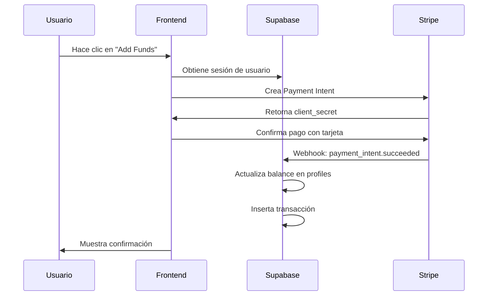
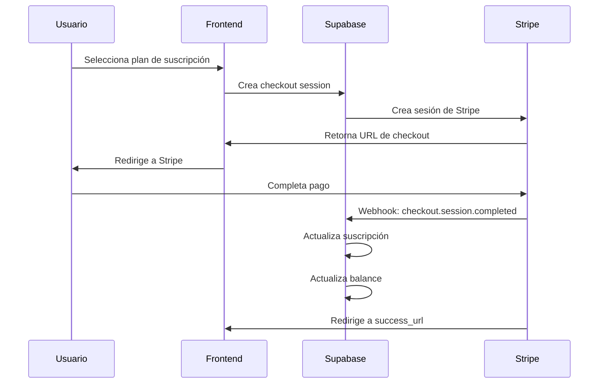

# Guía de Integración de Pagos - Spaceman Game

## Resumen

Esta guía explica cómo está configurada la integración de pagos con Stripe y Supabase en el juego Spaceman. El sistema maneja tanto pagos únicos como suscripciones, con un seguimiento completo de transacciones y balances de usuario.

## Arquitectura del Sistema

### 1. Base de Datos (Supabase)

#### Tablas Principales

**`profiles`** - Información del usuario y balance
```sql
- id (uuid, primary key)
- email (text, unique)
- balance (numeric, default 1000.00)
- total_deposits (numeric, default 0.00)
- total_withdrawals (numeric, default 0.00)
- created_at, updated_at
```

**`transactions`** - Historial de transacciones
```sql
- id (uuid, primary key)
- user_id (uuid, references profiles)
- type (text: 'deposit' | 'withdrawal')
- amount (numeric)
- status (text: 'pending' | 'completed' | 'failed')
- payment_method (text)
- stripe_payment_id (text)
- created_at
```

**`stripe_customers`** - Mapeo de usuarios con clientes de Stripe
```sql
- id (bigint, primary key)
- user_id (uuid, references auth.users)
- customer_id (text, unique)
- created_at, updated_at, deleted_at
```

**`stripe_subscriptions`** - Información de suscripciones
```sql
- id (bigint, primary key)
- customer_id (text, unique)
- subscription_id (text)
- price_id (text)
- status (enum: stripe_subscription_status)
- current_period_start, current_period_end
- cancel_at_period_end (boolean)
- payment_method_brand, payment_method_last4
```

**`stripe_orders`** - Registro de órdenes/pagos
```sql
- id (bigint, primary key)
- checkout_session_id (text)
- payment_intent_id (text)
- customer_id (text)
- amount_subtotal, amount_total (bigint)
- currency (text)
- payment_status (text)
- status (enum: stripe_order_status)
```

#### Vistas Seguras

**`stripe_user_subscriptions`** - Vista para datos de suscripción del usuario
**`stripe_user_orders`** - Vista para historial de órdenes del usuario

### 2. Funciones de Supabase

#### `stripe-checkout` Function
- **Propósito**: Crear sesiones de checkout de Stripe
- **Endpoint**: `/functions/v1/stripe-checkout`
- **Funcionalidades**:
  - Autenticación de usuario
  - Creación/gestión de clientes de Stripe
  - Creación de sesiones de checkout
  - Manejo de metadatos (user_id, coins, amount)

#### `stripe-webhook` Function
- **Propósito**: Procesar webhooks de Stripe
- **Endpoint**: `/functions/v1/stripe-webhook`
- **Eventos manejados**:
  - `checkout.session.completed`
  - `payment_intent.succeeded`
  - `customer.subscription.created/updated`
  - `customer.subscription.deleted`

### 3. Componentes Frontend

#### `StripePaymentForm`
- Formulario de pago con tarjeta
- Integración con Stripe Elements
- Manejo de errores de pago
- Autenticación con Supabase

#### `SubscriptionStatus`
- Muestra estado de suscripción
- Información de método de pago
- Fechas de facturación
- Estados de cancelación

#### `TransactionHistory`
- Historial de transacciones
- Filtrado por usuario
- Formateo de fechas y montos
- Estados de transacciones

#### `BettingPanel`
- Panel principal de balance
- Botones de depósito
- Integración con modales de pago
- Actualización automática de balance

### 4. Hooks Personalizados

#### `usePayments`
- Hook centralizado para operaciones de pago
- Creación de payment intents
- Creación de sesiones de checkout
- Obtención de historial y balance
- Manejo de errores

## Flujo de Pago

### 1. Pago Único (Payment Intent)



### 2. Suscripción (Checkout Session)



## Configuración de Variables de Entorno

### Frontend (.env)
```bash
VITE_STRIPE_PUBLISHABLE_KEY=pk_test_...
VITE_SUPABASE_URL=https://...
VITE_SUPABASE_ANON_KEY=eyJ...
```

### Backend (Supabase Functions)
```bash
STRIPE_SECRET_KEY=sk_test_...
STRIPE_WEBHOOK_SECRET=whsec_...
SUPABASE_URL=https://...
SUPABASE_SERVICE_ROLE_KEY=eyJ...
```

## Seguridad

### Row Level Security (RLS)
- Todas las tablas tienen RLS habilitado
- Políticas para que usuarios solo vean sus propios datos
- Autenticación requerida para todas las operaciones

### Webhook Security
- Verificación de firma de Stripe
- Validación de eventos
- Manejo de errores robusto

### Autenticación
- Tokens JWT de Supabase
- Verificación en cada endpoint
- Middleware de autenticación

## Manejo de Errores

### Errores de Pago
- Códigos de error específicos de Stripe
- Mensajes amigables para el usuario
- Logging detallado para debugging

### Errores de Base de Datos
- Transacciones atómicas
- Rollback en caso de error
- Notificaciones de error

## Monitoreo y Logging

### Logs de Stripe
- Eventos de webhook
- Creación de payment intents
- Errores de pago

### Logs de Supabase
- Operaciones de base de datos
- Errores de autenticación
- Performance de queries

## Pruebas

### Modo de Prueba
- Usar claves de prueba de Stripe
- Tarjetas de prueba disponibles
- Webhooks de prueba configurados

### Casos de Prueba
1. Pago exitoso con tarjeta válida
2. Pago fallido con tarjeta inválida
3. Creación de suscripción
4. Cancelación de suscripción
5. Webhook de pago fallido

## Mantenimiento

### Actualizaciones de Stripe
- Mantener SDK actualizado
- Revisar cambios en API
- Actualizar webhooks según sea necesario

### Backup de Datos
- Backup regular de tablas de transacciones
- Exportación de datos de clientes
- Logs de auditoría

## Troubleshooting

### Problemas Comunes

1. **Webhook no recibido**
   - Verificar URL del webhook
   - Revisar logs de Supabase Functions
   - Verificar firma del webhook

2. **Balance no actualizado**
   - Verificar procesamiento del webhook
   - Revisar políticas RLS
   - Verificar transacciones en base de datos

3. **Error de autenticación**
   - Verificar token JWT
   - Revisar configuración de Supabase
   - Verificar variables de entorno

### Debugging
- Logs detallados en todas las funciones
- Console.log en frontend para debugging
- Herramientas de desarrollo de Stripe
- Dashboard de Supabase para monitoreo

## Próximos Pasos

1. **Implementar retiros**
   - Endpoint para solicitudes de retiro
   - Aprobación manual de retiros
   - Integración con métodos de pago

2. **Notificaciones**
   - Email de confirmación de pago
   - Notificaciones push
   - Alertas de suscripción

3. **Analytics**
   - Dashboard de ventas
   - Métricas de conversión
   - Reportes de transacciones

4. **Optimizaciones**
   - Cache de balance
   - Paginación de transacciones
   - Optimización de queries