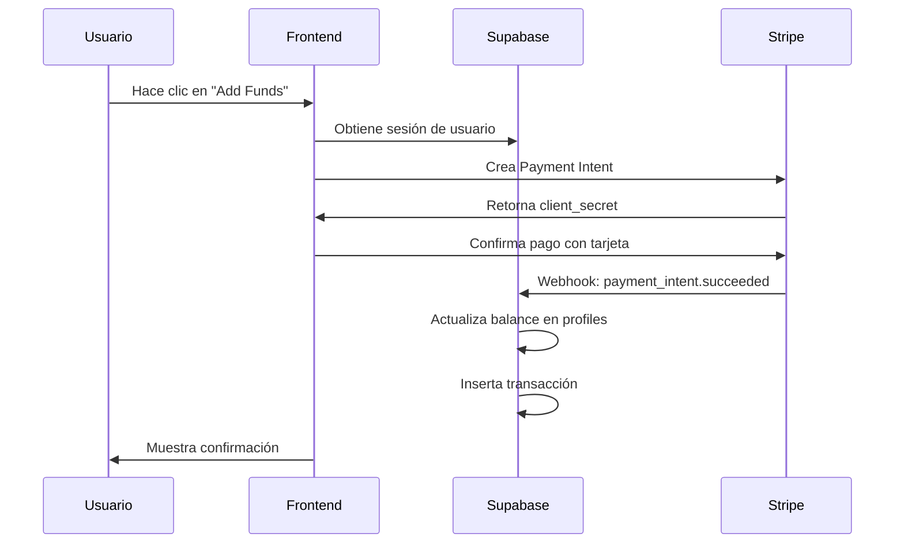
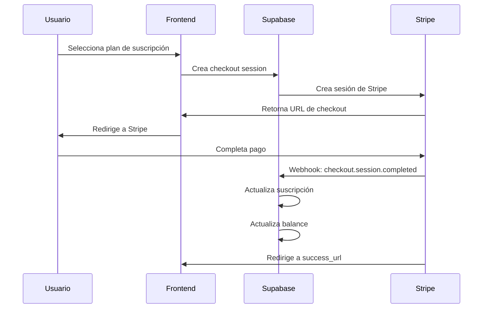
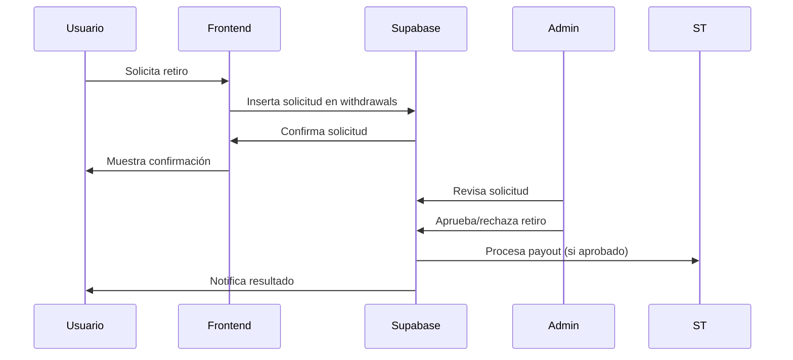
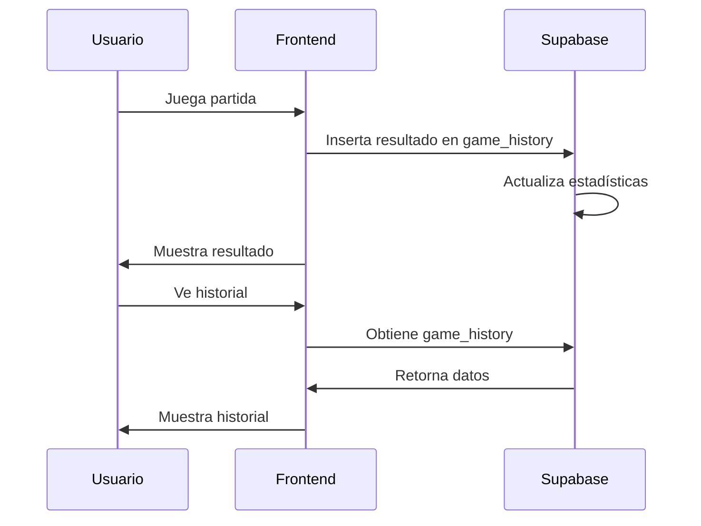

# Guía de Integración de Pagos - Spaceman Game

## Resumen

Esta guía explica cómo está configurada la integración completa de pagos con Stripe y Supabase en el juego Spaceman. El sistema maneja pagos únicos, suscripciones, retiros, historial de partidas, métodos de pago guardados y un seguimiento completo de transacciones y balances de usuario.

## Arquitectura del Sistema

### 1. Base de Datos (Supabase)

#### Tablas Principales

**`profiles`** - Información del usuario y balance
```sql
- id (uuid, primary key)
- email (text, unique)
- balance (numeric, default 1000.00)
- total_deposits (numeric, default 0.00)
- total_withdrawals (numeric, default 0.00)
- created_at, updated_at
```

**`game_history`** - Historial completo de partidas jugadas
```sql
- id (uuid, primary key)
- user_id (uuid, references profiles)
- game_id (text, not null)
- bet_amount (decimal(10,2), not null)
- multiplier (decimal(10,4), not null)
- win_amount (decimal(10,2), not null)
- game_type (text, default 'spaceman')
- status (text, default 'completed')
- session_id (text)
- metadata (jsonb)
- created_at (timestamptz)
```

**`transactions`** - Historial detallado de transacciones
```sql
- id (uuid, primary key)
- user_id (uuid, references profiles)
- type (text: 'deposit' | 'withdrawal')
- amount (numeric, not null)
- status (text: 'pending' | 'completed' | 'failed')
- payment_method (text, not null)
- stripe_payment_id (text)
- stripe_payment_method_id (text)
- description (text)
- fee_amount (numeric, default 0)
- net_amount (numeric)
- currency (text, default 'usd')
- metadata (jsonb)
- created_at (timestamptz)
```

**`withdrawals`** - Solicitudes de retiro
```sql
- id (uuid, primary key)
- user_id (uuid, references auth.users)
- amount (numeric, not null)
- status (text: 'pending' | 'approved' | 'rejected' | 'completed' | 'failed')
- payment_method (text, not null)
- account_details (jsonb, not null) -- Bank account, PayPal, crypto details
- fee_amount (numeric, default 0)
- net_amount (numeric)
- currency (text, default 'usd')
- stripe_payout_id (text)
- approved_by (uuid, references auth.users)
- approved_at (timestamptz)
- rejection_reason (text)
- created_at, updated_at (timestamptz)
```

**`payment_methods`** - Métodos de pago guardados
```sql
- id (uuid, primary key)
- user_id (uuid, references auth.users)
- stripe_payment_method_id (text, not null)
- type (text: 'card' | 'bank_account' | 'paypal')
- brand (text) -- visa, mastercard, etc.
- last4 (text)
- expiry_month (integer)
- expiry_year (integer)
- is_default (boolean, default false)
- is_active (boolean, default true)
- created_at, updated_at, deleted_at (timestamptz)
```

**`stripe_customers`** - Mapeo de usuarios con clientes de Stripe
```sql
- id (bigint, primary key)
- user_id (uuid, references auth.users)
- customer_id (text, unique)
- created_at, updated_at, deleted_at
```

**`stripe_subscriptions`** - Información de suscripciones
```sql
- id (bigint, primary key)
- customer_id (text, unique)
- subscription_id (text)
- price_id (text)
- status (enum: stripe_subscription_status)
- current_period_start, current_period_end
- cancel_at_period_end (boolean)
- payment_method_brand, payment_method_last4
```

**`stripe_orders`** - Registro de órdenes/pagos
```sql
- id (bigint, primary key)
- checkout_session_id (text)
- payment_intent_id (text)
- customer_id (text)
- amount_subtotal, amount_total (bigint)
- currency (text)
- payment_status (text)
- status (enum: stripe_order_status)
```

#### Vistas Seguras

**`user_transaction_history`** - Vista completa del historial de transacciones
```sql
-- Combina depósitos, retiros, ganancias y pérdidas del juego
-- Filtrado por usuario autenticado
-- Ordenado por fecha descendente
```

**`stripe_user_subscriptions`** - Vista para datos de suscripción del usuario
**`stripe_user_orders`** - Vista para historial de órdenes del usuario

### 2. Funciones de Supabase

#### `stripe-checkout` Function
- **Propósito**: Crear sesiones de checkout de Stripe
- **Endpoint**: `/functions/v1/stripe-checkout`
- **Funcionalidades**:
  - Autenticación de usuario
  - Creación/gestión de clientes de Stripe
  - Creación de sesiones de checkout
  - Manejo de metadatos (user_id, coins, amount)

#### `stripe-webhook` Function
- **Propósito**: Procesar webhooks de Stripe
- **Endpoint**: `/functions/v1/stripe-webhook`
- **Eventos manejados**:
  - `checkout.session.completed`
  - `payment_intent.succeeded`
  - `customer.subscription.created/updated`
  - `customer.subscription.deleted`

### 3. Componentes Frontend

#### `TransactionHistory`
- Historial completo de transacciones
- Filtrado por tipo (depósitos, retiros, juegos)
- Exportación a CSV
- Detalles expandibles
- Estados de transacciones con iconos

#### `WithdrawalForm`
- Formulario para solicitar retiros
- Múltiples métodos de pago (banco, PayPal, crypto)
- Validación de montos mínimos
- Información de comisiones y tiempos

#### `PaymentMethods`
- Gestión de métodos de pago guardados
- Establecer método predeterminado
- Eliminar métodos de pago
- Información de seguridad

#### `Statistics`
- Estadísticas del juego en tiempo real
- Resumen financiero completo
- Historial de partidas recientes
- Métricas de rendimiento

#### `AccountPanel`
- Panel principal de cuenta
- Navegación por pestañas
- Integración de todos los componentes
- Configuración de usuario

### 4. Hooks Personalizados

#### `usePayments`
- Hook centralizado para operaciones de pago
- Gestión de métodos de pago
- Solicitudes de retiro
- Historial de transacciones
- Balance y estadísticas

#### `useGameData`
- Hook para datos del juego
- Historial de partidas
- Estadísticas de juego
- Actualización de balance
- Métricas de rendimiento

## Flujo de Pago

### 1. Pago Único (Payment Intent)



### 2. Suscripción (Checkout Session)



### 3. Retiro de Fondos



### 4. Historial de Partidas



## Características del Sistema

### 1. Historial Completo de Partidas
- **Registro automático**: Cada partida se guarda automáticamente
- **Metadatos**: Información adicional como tipo de juego, sesión, etc.
- **Estadísticas**: Cálculo automático de métricas de rendimiento
- **Filtrado**: Búsqueda y filtrado por diferentes criterios

### 2. Sistema de Retiros
- **Múltiples métodos**: Banco, PayPal, criptomonedas
- **Validación**: Montos mínimos, límites de cuenta
- **Estados**: Pending, approved, rejected, completed, failed
- **Aprobación manual**: Proceso de revisión por administradores
- **Comisiones**: Cálculo automático de comisiones

### 3. Métodos de Pago Guardados
- **Seguridad**: Encriptación SSL, cumplimiento PCI DSS
- **Gestión**: Agregar, eliminar, establecer predeterminado
- **Tipos**: Tarjetas, cuentas bancarias, PayPal
- **Información limitada**: Solo últimos 4 dígitos, sin datos completos

### 4. Transacciones Detalladas
- **Tipos**: Depósitos, retiros, ganancias, pérdidas
- **Metadatos**: Información adicional en formato JSON
- **Estados**: Seguimiento completo del estado de cada transacción
- **Exportación**: Funcionalidad para exportar a CSV

### 5. Estadísticas en Tiempo Real
- **Balance**: Actualización automática del balance
- **Métricas**: Win rate, mejor multiplicador, ganancias totales
- **Historial**: Partidas recientes con detalles
- **Tendencias**: Análisis de rendimiento a lo largo del tiempo

## Configuración de Variables de Entorno

### Frontend (.env)
```bash
VITE_STRIPE_PUBLISHABLE_KEY=pk_test_...
VITE_SUPABASE_URL=https://...
VITE_SUPABASE_ANON_KEY=eyJ...
```

### Backend (Supabase Functions)
```bash
STRIPE_SECRET_KEY=sk_test_...
STRIPE_WEBHOOK_SECRET=whsec_...
SUPABASE_URL=https://...
SUPABASE_SERVICE_ROLE_KEY=eyJ...
```

## Seguridad

### Row Level Security (RLS)
- Todas las tablas tienen RLS habilitado
- Políticas para que usuarios solo vean sus propios datos
- Autenticación requerida para todas las operaciones

### Webhook Security
- Verificación de firma de Stripe
- Validación de eventos
- Manejo de errores robusto

### Autenticación
- Tokens JWT de Supabase
- Verificación en cada endpoint
- Middleware de autenticación

### Datos Sensibles
- Encriptación SSL para todos los datos
- No almacenamiento de información completa de tarjetas
- Cumplimiento con estándares PCI DSS
- Soft delete para métodos de pago

## Manejo de Errores

### Errores de Pago
- Códigos de error específicos de Stripe
- Mensajes amigables para el usuario
- Logging detallado para debugging

### Errores de Base de Datos
- Transacciones atómicas
- Rollback en caso de error
- Notificaciones de error

### Errores de Retiro
- Validación de montos mínimos
- Verificación de saldo disponible
- Proceso de aprobación manual

## Monitoreo y Logging

### Logs de Stripe
- Eventos de webhook
- Creación de payment intents
- Errores de pago

### Logs de Supabase
- Operaciones de base de datos
- Errores de autenticación
- Performance de queries

### Logs de Aplicación
- Historial de partidas
- Transacciones de usuario
- Errores de sistema

## Pruebas

### Modo de Prueba
- Usar claves de prueba de Stripe
- Tarjetas de prueba disponibles
- Webhooks de prueba configurados

### Casos de Prueba
1. Pago exitoso con tarjeta válida
2. Pago fallido con tarjeta inválida
3. Creación de suscripción
4. Cancelación de suscripción
5. Solicitud de retiro
6. Aprobación/rechazo de retiro
7. Registro de partida jugada
8. Cálculo de estadísticas
9. Gestión de métodos de pago
10. Exportación de historial

## Mantenimiento

### Actualizaciones de Stripe
- Mantener SDK actualizado
- Revisar cambios en API
- Actualizar webhooks según sea necesario

### Backup de Datos
- Backup regular de tablas de transacciones
- Exportación de datos de clientes
- Logs de auditoría
- Historial de partidas

### Optimización
- Índices en tablas principales
- Paginación de resultados
- Cache de estadísticas
- Compresión de metadatos

## Troubleshooting

### Problemas Comunes

1. **Webhook no recibido**
   - Verificar URL del webhook
   - Revisar logs de Supabase Functions
   - Verificar firma del webhook

2. **Balance no actualizado**
   - Verificar procesamiento del webhook
   - Revisar políticas RLS
   - Verificar transacciones en base de datos

3. **Error de autenticación**
   - Verificar token JWT
   - Revisar configuración de Supabase
   - Verificar variables de entorno

4. **Historial no se guarda**
   - Verificar permisos de inserción
   - Revisar estructura de datos
   - Verificar triggers de base de datos

5. **Retiro no procesado**
   - Verificar estado de la solicitud
   - Revisar proceso de aprobación
   - Verificar configuración de Stripe

### Debugging
- Logs detallados en todas las funciones
- Console.log en frontend para debugging
- Herramientas de desarrollo de Stripe
- Dashboard de Supabase para monitoreo

## Próximos Pasos

1. **Implementar notificaciones push**
   - Confirmación de pagos
   - Estado de retiros
   - Logros en el juego

2. **Analytics avanzados**
   - Dashboard de ventas
   - Métricas de conversión
   - Reportes de transacciones
   - Análisis de comportamiento

3. **Funcionalidades adicionales**
   - Bonos y promociones
   - Sistema de niveles
   - Torneos y competencias
   - Chat en vivo

4. **Optimizaciones**
   - Cache de balance
   - Paginación de transacciones
   - Optimización de queries
   - Compresión de datos

5. **Seguridad avanzada**
   - Verificación en dos pasos
   - Límites de transacción
   - Detección de fraude
   - Auditoría completa